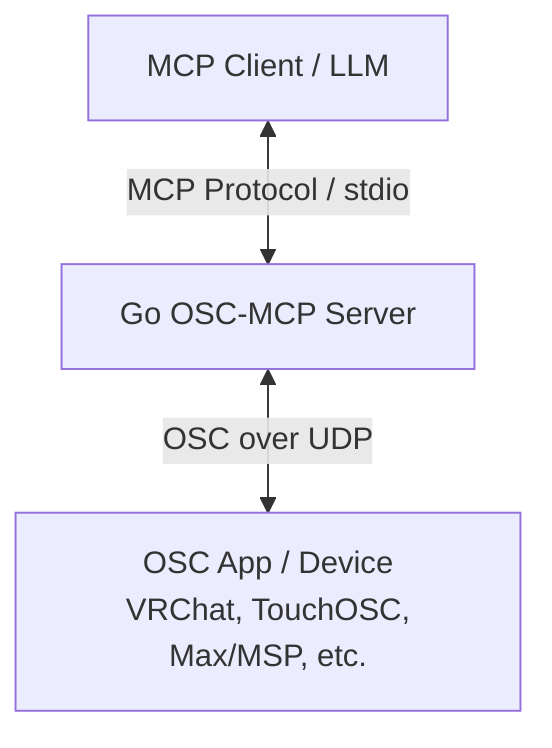

# OSC (Open Sound Control) MCP Server Specification

This specification document details the bridge server architecture mediating between the Open Sound Control (OSC) protocol and the Model Context Protocol (MCP). It is built using the Go language to allow AI models (LLMs) to communicate directly with OSC-compatible hardware and software (such as VRChat, audio/lighting gear, or music tools).

---

## 1. System Overview & Architecture

The system listens for JSON-RPC 2.0 requests from an MCP Client (e.g. Claude Desktop) via standard input/output (stdio), parses the commands, and communicates with external OSC devices over UDP.



---

## 2. Technical Stack

- **Language**: Go (Go 1.21 or higher)
- **Dependency Restrictions**: Built exclusively using Go's standard library (`net`, `encoding/binary`, `encoding/json` etc.) without any third-party dependencies to guarantee security and portability.
- **Protocol Channels**:
  - MCP: JSON-RPC 2.0 over standard I/O (stdio). Logging is restricted to standard error (`os.Stderr`) to protect the protocol stream from corruption.
  - OSC: UDP packet exchange over designated ports and hosts.

---

## 3. MCP Interfaces (Tools & Resources)

### 3.1. Registered Tools

#### ① `send_osc`
Sends an OSC message containing typed arguments to the target IP, port, and address.

- **Parameters**:
  - `host` (string, optional): Target IP address (default: `127.0.0.1`).
  - `port` (integer, required): Target UDP port (e.g. `9000` for VRChat).
  - `address` (string, required): OSC address pattern starting with a slash `/`.
  - `args` (array, optional): List of argument objects:
    - `type` (string): Specified as `"int"`, `"float"`, `"string"`, or `"bool"`.
    - `value` (any): The argument payload.
- **Casting & Validations**:
  - `int`: Encoded as a 32-bit signed integer (`int32`). Values must fall in the range `-2147483648` to `2147483647`.
  - `float`: Encoded as a 32-bit IEEE 754 single-precision float (`float32`).
  - `string`: Encoded as a null-terminated ASCII string padded to a multiple of 4 bytes.
  - `bool`: Uses the type tags `T` (True) or `F` (False) in the OSC header without appending data bytes.

#### ② `start_listen_osc`
Spawns a UDP socket reader in the background on the specified port.

- **Parameters**:
  - `port` (integer, required): Local UDP port to bind.
  - `host` (string, optional): Local IP to bind (default: `127.0.0.1` for security).
- **Behavior**:
  - Spawns a background goroutine receiver loop.
  - If a listener is already active on the port, it keeps the socket alive and returns the current status.
  - Caches up to 100 received messages per port in a ring buffer.

#### ③ `stop_listen_osc`
Closes the UDP listener socket on the given port and stops the receiver thread.

- **Parameters**:
  - `port` (integer, required): Port to release.

---

### 3.2. Registered Resources

#### ① `osc://messages/{port}/recent`
Provides a listing of cached OSC messages received on a specific port.

- **JSON Payload Schema**:
  ```json
  {
    "port": 9001,
    "retrievedAt": "2026-06-06T18:25:51+09:00",
    "messages": [
      {
        "timestamp": "2026-06-06T18:25:50+09:00",
        "from": "127.0.0.1:51234",
        "address": "/avatar/parameters/Mute",
        "args": [
          { "type": "bool", "value": true }
        ]
      }
    ]
  }
  ```

---

## 4. Architectural Rules & Compliance

- **Resource Lifecycle**: Open sockets are guaranteed to close gracefully upon receiving termination signals (`SIGINT`, `SIGTERM`).
- **Memory Safety**: Message caches are strictly capped at 100 elements to prevent unbounded memory growth.
- **Concurrency Protection**: Shared states, active sockets, and cache slices are protected using `sync.RWMutex`.
- **Buffer Reuse**: Receiver loops reuse a `65535`-byte buffer allocated via `sync.Pool` to optimize garbage collection.
- **OSC Bundles**: Incoming packets beginning with the `#bundle\x00` signature are immediately unpacked into separate messages.
